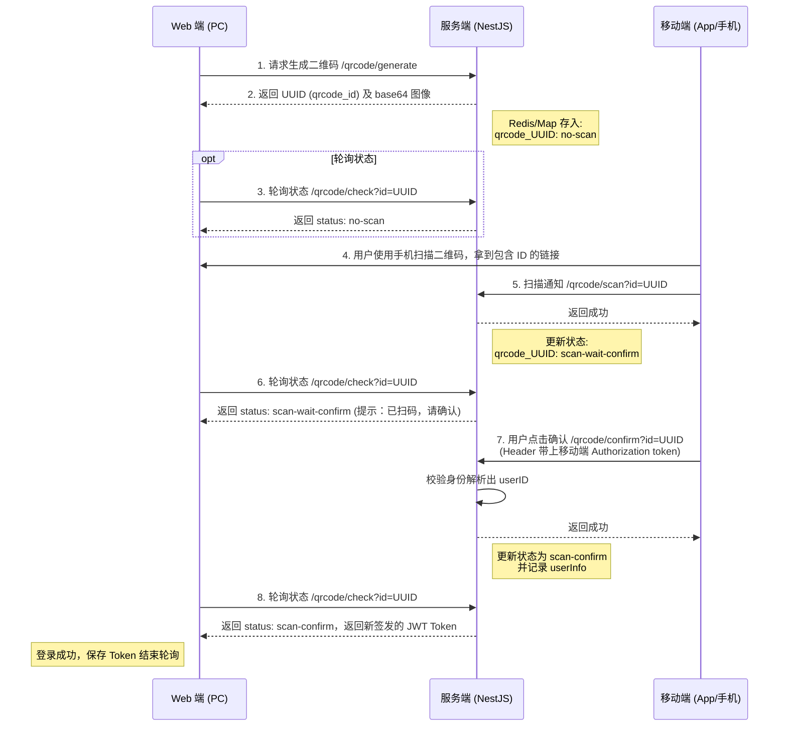

# NestJS 扫码登录演示 (Scan QR Code Login)

本项目展示了一个基于 NestJS 的扫码登录实现流程。

## 扫码登录流程

整个扫码登录的核心交互涉及三端：**Web前端（PC网页）**、**移动端（扫描设备，App或微信等）** 和 **服务端（NestJS）**。主要步骤如下：

1. **生成二维码**：Web 端向服务端请求生成二维码 (`/qrcode/generate`)。服务端生成一个唯一的 UUID 作为标识，将它存入缓存（Map/Redis）初始状态为 `no-scan`（未扫描），并生成对应的二维码图片返回给 Web 端展示。
2. **轮询状态**：Web 端拿到二维码后，开始定时向服务端轮询该二维码的状态 (`/qrcode/check?id=UUID`)。
3. **扫码标记**：移动端（已登录状态）扫描该二维码，请求服务端的扫码接口 (`/qrcode/scan?id=UUID`)。服务端将二维码状态更新为 `scan-wait-confirm`（已扫描，等待确认）。Web 端轮询到此状态时，可提示用户“已扫码，请在手机上确认”。
4. **授权确认/取消**：
   - **确认**：用户在手机上点击确认登录，移动端携带自身的身份凭证（Token）请求服务端确认接口 (`/qrcode/confirm?id=UUID`)。服务端验证身份后，将二维码状态更新为 `scan-confirm`（已授权登录），并绑定该用户信息。
   - **取消**：用户在手机上点击取消，请求服务端取消接口 (`/qrcode/cancel?id=UUID`)，状态更新为 `scan-cancel`。
5. **PC端登录成功**：Web 端再次轮询获取到状态为 `scan-confirm`，同时服务端会在此步骤生成一个新的 JWT Token 返回。Web 端获取到 Token 即完成了登录。

## 时序图 (Sequence Diagram)

